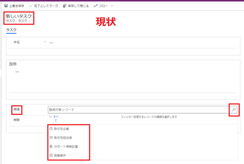
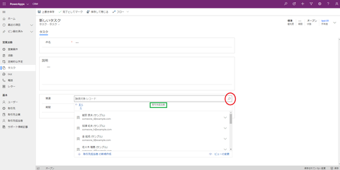
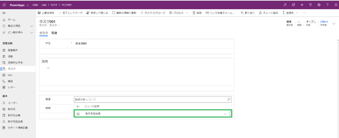

# D365Script.FilterForActivities
Dynamics CRM 関連検索項目の絞込表示メモ(How to add a filter to the regarding lookup field in Dynamics365) 
  
 ## ■現状：
#### 【タスク】エンティテの「関連」項目をクリックすると、関連している4種類のレコードを参照できる。
#### 下記は「関連」項目にフィルターを追加する前の様子👇 

  
##  ■要望：
#### 【タスク】エンティテの「関連」項目に【取引先担当者】のみ参照できる。
  
##  ■対応方法：
#### 埋め込みJavaScriptを使用し、関連項目にフィルターを追加し、対象のエンティティしか表示させない。
#### タスクのフォームで（フォームのOnLoad）と（関連のOnChange）イベントに登録する。
  
## ■結果
#### ①タスクを新規作成する場合👇　   
#### ②関連を更新する場合👇　   
  
#### ■参考：
・[Dynamics CRM 関連検索項目の絞込表示メモ(How to add a filter to the regarding lookup field in Dynamics CRM)](http://nashma.blog.jp/archives/Dynamics%20CRM%20%E9%96%A2%E9%80%A3%E6%A4%9C%E7%B4%A2%E9%A0%85%E7%9B%AE%E3%81%AE%E7%B5%9E%E8%BE%BC%E8%A1%A8%E7%A4%BA%E3%83%A1%E3%83%A2(How%20to%20add%20a%20filter%20to%20the%20regarding%20lookup%20field%20in%20Dynamics%20CRM).html)  
・[Filter PartyList Field based on other lookup field that supports on UCI Dynamics 365 v9.x](https://www.inogic.com/blog/2018/11/filter-partylist-field-based-on-other-lookup-field-that-supports-on-uci-dynamics-365-v9-x/)
